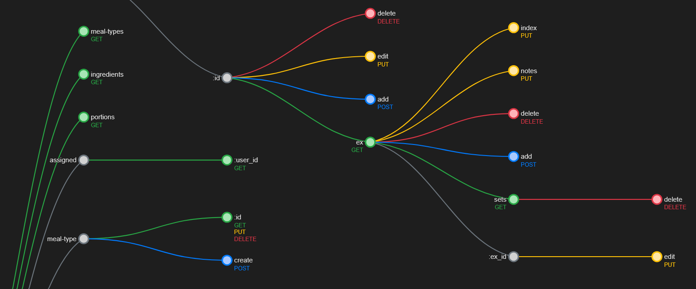

<p align="center">
  
</p>

<h1 align="center">Express Router Diagram</h1>

<p align="center">
  <a href="https://www.npmjs.com/package/express-router-diagram">
    
  </a>
  <a href="https://github.com/your-username/express-router-diagram/actions">
    
  </a>
  <a href="https://github.com/your-username/express-router-diagram/blob/main/LICENSE">
    
  </a>
</p>

A lightweight utility for visualizing Express.js routes. This package helps you understand the structure of your Express application by extracting and displaying all defined routes in an interactive D3.js visualization.

## ✨ Features

- 📊 Extract all routes from an Express application
- 🔄 Generate interactive web-based flow diagrams of your routes
- 🎨 Color-coded HTTP methods (GET, POST, PUT, DELETE, PATCH)
- 🖱️ Interactive navigation with zoom, pan, and pinch-to-zoom support
- 📱 Mobile and touch device support
- 💾 Export diagram as PNG
- 🛣️ Customizable visualization URL path

## 📦 Installation

```bash
npm install express-router-diagram
```

## 🚀 Quick Start

### As Middleware

The simplest way to use express-router-diagram is as middleware in your Express application:

```javascript
const express = require('express');
const routerDiagram = require('express-router-diagram');

const app = express();

// Define your routes
app.get('/', (req, res) => res.send('Hello World!'));
app.post('/users', (req, res) => res.json({ success: true }));
// ... more routes

// Add the router diagram middleware at the end
app.use(routerDiagram({
  generateWeb: true,  // Enable web visualization
  // Optional: 
  //  customize the visualization URL 
  //  (default: express-routes)
  // webRoute: 'routes/diagram' 
}));

app.listen(3000, () => {
  console.log('Server started on port 3000');
});
```

> **Note:** The `webRoute` option doesn't need a leading slash. If provided, it will be added automatically. This helps avoid issues when using the CLI where paths with leading slashes might be interpreted as file paths.

### CLI Usage

You can also use the CLI tool to start a standalone web server that visualizes the routes of your Express app:

```bash
npx express-router-diagram --app ./app.js --server [port]
```

This will start a web server (default port: 3000) that displays the flow diagram. You can access it at:

```
http://localhost:3000/express-routes
```

You can customize the visualization URL path:

```bash
npx express-router-diagram --app ./app.js --server 3000 --diagram-route routes/diagram
```

Then access the visualization at:

```
http://localhost:3000/routes/diagram
```

> **Note:** When using the `--diagram-route` parameter, do not include a leading slash. This helps avoid issues where paths with leading slashes might be interpreted as file paths in some environments.

## 📊 Web Visualization

When you enable the web-based visualization with the `generateWeb` option, a route at `/express-routes` (or your custom path) is added to your application. This route displays an interactive D3.js diagram of your API routes.

The diagram provides:
- A hierarchical view of your API structure
- Color-coded HTTP methods (GET: green, POST: blue, PUT: yellow, DELETE: red, PATCH: teal)
- Interactive navigation with zoom, pan, and pinch-to-zoom support
- A floating menu for navigating between related nodes
- Export functionality to save the diagram as a PNG image

### Interactive Features

The diagram includes several interactive features:
- **Zoom and Pan**: Click and drag to move around, use the mousewheel to zoom
- **Pinch-to-Zoom**: Use pinch gestures on touchscreens or trackpads to zoom in and out
- **Node Navigation**: Click on any node to open a floating menu showing parent and child nodes
- **Draggable Menu**: The node menu can be dragged around for better visibility
- **Direct Navigation**: Click on any node in the menu to navigate directly to that node

## ⚙️ Configuration

You can customize the middleware behavior with options:

```javascript
app.use(routerDiagram({
  // Whether to print routes to console
  logToConsole: true,
  
  // Save routes to a file
  outputFile: './routes.txt',
  
  // Exclude routes matching these patterns
  excludePatterns: ['/admin'],
  
  // Display routes in a hierarchical structure (default: true)
  hierarchical: true,
  
  // Generate web-based flow diagram (default: false)
  generateWeb: true,
  
  // Custom route path for the web visualization (default: "express-routes")
  webRoute: 'routes/diagram'
}));
```

## 🧰 CLI Options

The CLI tool provides several options:

```
Options:
  -a, --app <file>         Express application module to analyze (required)
  -o, --output <file>      Output file (default: stdout)
  -s, --server [port]      Start a web server to visualize routes (default port: 3000)
  --color-file             Include ANSI color codes in the output file (default: no colors)
  --diagram-route <path>   Custom route path for the web visualization (default: express-routes)
                           Note: Do not include a leading slash, it will be added automatically
  -h, --help               Show this help message
```

Examples:
```bash
# Output routes to console
express-router-diagram --app ./app.js

# Save routes to a file
express-router-diagram --app ./app.js --output routes-diagram.txt

# Save routes to a file with color codes
express-router-diagram --app ./app.js --output routes-diagram.txt --color-file

# Start a web server on port 8080
express-router-diagram --app ./app.js --server 8080

# Start a web server with a custom route path
express-router-diagram --app ./app.js --server 8080 --diagram-route routes/diagram
```

## 📝 API Reference

### Middleware

```javascript
routerDiagram(options)
```

Returns an Express middleware function that extracts and prints routes.

Options:
- `logToConsole` (boolean): Whether to print routes to console (default: true)
- `outputFile` (string): Path to save routes diagram (default: null)
- `excludePatterns` (array): Array of regex patterns to exclude from output (default: [])
- `hierarchical` (boolean): Display routes in a hierarchical structure (default: true)
- `generateWeb` (boolean): Generate web-based flow diagram (default: false)
- `webRoute` (string): Custom route path for the web visualization (default: "express-routes"). 
  Leading slash is optional and will be added automatically if missing.

### Functions

- `printAppRoutes(app, options)`: Extract and print routes from an Express app
- `extractRoutesFromApp(app)`: Extract routes from an Express app
- `printRoutes(routes, options)`: Print routes to the console
- `generateTextDiagram(routes, options)`: Generate a text representation of routes
- `saveDiagram(diagram, outputPath)`: Save a diagram to a file
- `organizeRoutesHierarchy(routes)`: Organize routes into a hierarchical structure


## 🌐 Browser Support

The web-based visualization supports all modern browsers, including:
- Chrome, Firefox, Safari, Edge
- Mobile browsers on iOS and Android
- Touch-enabled devices with pinch-to-zoom support

## 📚 Examples

### Programmatic Usage

You can use the package programmatically in your code:

```javascript
const express = require('express');
const { printAppRoutes } = require('express-router-diagram');

const app = express();

// Define your routes
app.get('/', (req, res) => res.send('Hello World!'));
app.post('/users', (req, res) => res.json({ success: true }));

// Print routes with hierarchical view (default)
printAppRoutes(app);
```

### Output to File

You can output the routes to a file instead of starting a web server:

```bash
npx express-router-diagram --app ./app.js --output routes.txt
```

To include ANSI color codes in the output file, use the `--color-file` flag:

```bash
npx express-router-diagram --app ./app.js --output routes.txt --color-file
```

## 🤝 Contributing

Contributions are welcome! Please feel free to submit a Pull Request.

## 📄 License

This project is licensed under the MIT License - see the [LICENSE](LICENSE) file for details.

## 📦 Dependencies

- [express](https://www.npmjs.com/package/express): Web framework for Node.js
- [d3](https://www.npmjs.com/package/d3): Data visualization library for creating dynamic diagrams